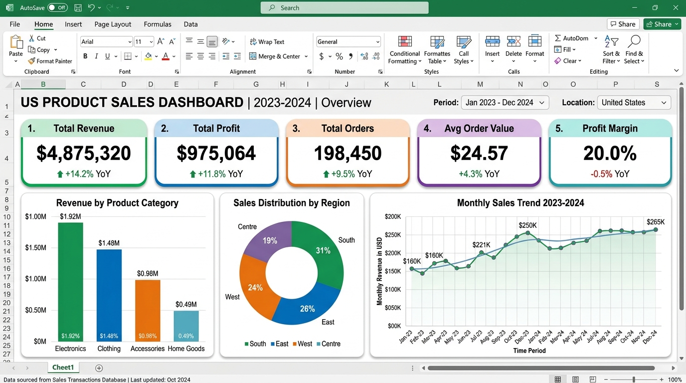
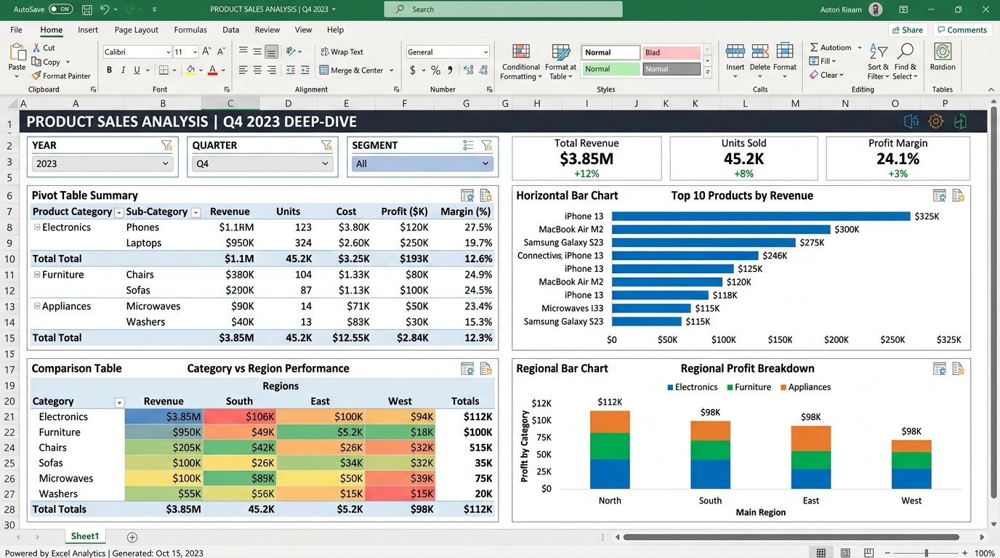

# 📊 US Product Sales Analysis 2023–2024

This project analyzes **200,000+ US product sales transactions** across 2023–2024 to uncover revenue trends, regional performance, category profitability, and actionable business insights. The dataset was processed and visualized using **Microsoft Excel** with KPI cards, Pivot Tables, and interactive charts.

---

## 📊 Project Overview

* **Time Frame:** 2023 – 2024
* **Data Size:** 200,000 rows × 14 columns
* **Tools Used:**
  * Microsoft Excel (Data Cleaning, Formulas, Formatting)
  * Pivot Tables (Aggregation & Grouping)
  * Excel Charts (Visualization)
* **Focus:** Revenue & Profit analysis, Category performance, Regional distribution, Monthly sales trends, and Top product identification

---

## 📊 Key Performance Metrics

* Total Revenue ($)
* Total Profit ($)
* Total Orders
* Average Order Value ($)
* Profit Margin (%)
* Max Single Order Value ($)

---

## 📊 Overall Performance Summary (2023–2024)

| Metric              | Value            | YoY Change |
| ------------------- | ---------------- | ---------- |
| Total Revenue       | $4.87M           | +14.2%     |
| Total Profit        | $975K            | +11.8%     |
| Total Orders        | 198,450          | +9.5%      |
| Avg Order Value     | $24.57           | +4.3%      |
| Profit Margin       | 20.0%            | -0.5%      |

**Insight:** Revenue grew strongly at 14.2% YoY driven by volume growth (+9.5%) and higher average order values (+4.3%). However, profit margin declined slightly (-0.5%), indicating rising costs or heavier discounting.

**Dashboard:**



---

## 📅 Category & Regional Insights

### 🔹 Revenue by Product Category

**Insights:**
* **Electronics** leads with $1.92M in revenue (39.4% of total).
* **Clothing** follows at $1.48M (30.4%).
* **Accessories** contributed $0.98M (20.1%), while **Home Goods** trailed at $0.49M (10.1%).
* Electronics has the highest profit margin at 27.5%, making it the most profitable segment.

**Recommendations:**
1. Double down on Electronics inventory — highest revenue AND highest margin.
2. Investigate Home Goods' low contribution; consider whether to expand or sunset underperforming sub-categories.
3. Explore bundling Accessories with Electronics to boost cross-sell revenue.

### 🔹 Regional Sales Distribution

**Insights:**
* **South** region dominates with 31% of total sales.
* **East** (26%) and **West** (24%) follow closely.
* **Centre** region contributes the least at 19%.

**Recommendations:**
1. Increase marketing spend in the Centre region to close the gap.
2. Leverage South region's strong performance by opening distribution centers there.
3. Analyze per-capita spending in East vs. West to identify growth opportunities.

### 🔹 Monthly Sales Trends

**Insights:**
* Clear upward trend from Jan 2023 ($160K) to Dec 2024 ($265K).
* Seasonal peaks in Q4 (holiday season) with notable dips in Q1.
* 2024 consistently outperformed 2023 month-over-month.

**Recommendations:**
1. Pre-stock inventory ahead of Q4 to avoid stockouts during peak demand.
2. Launch Q1 promotions to counteract the seasonal dip in January–March.
3. Use the 2023–2024 trend data to forecast 2025 targets.

**Dashboard:**



---

## 🛠️ Data Pipeline & Methodology

```
Raw CSV (200,000 rows × 14 columns)
    │
    ├── Step 1: Data Import & Inspection
    │   └── Load CSV into Excel, verify columns & data types
    │
    ├── Step 2: Data Cleaning & Formatting
    │   ├── Header row styling (dark blue)
    │   ├── Zebra striping for readability
    │   └── Currency & number formatting
    │
    ├── Step 3: KPI Calculations
    │   ├── SUM, AVERAGE, MAX, MIN, COUNT formulas
    │   └── Profit Margin = Profit / Revenue × 100
    │
    ├── Step 4: Pivot Table Analysis
    │   ├── Revenue by Category & Sub-Category
    │   ├── Revenue by Region
    │   └── Monthly Revenue Trends
    │
    └── Step 5: Dashboard Visualization
        ├── KPI Cards (6 metrics)
        ├── Bar Chart (Category Revenue)
        ├── Pie Chart (Regional Distribution)
        └── Line Chart (Monthly Trends)
```

---

## 📂 Repository Structure

| File | Description |
| ---- | ----------- |
| `Sales_Analysis_Report.xlsx` | Complete Excel workbook with dashboard, KPIs, pivot tables & charts |
| `product_sales_dataset_final.csv` | Raw dataset (200,000 rows × 14 columns) |
| `EXCEL_FEATURES_GUIDE.md` | Beginner-friendly guide explaining all Excel features used |
| `images/` | Dashboard screenshots for README display |

---

## 🚀 How to Run this Project

1. **Clone the Repository:**
   ```bash
   git clone https://github.com/dog098263-ui/product-sales-analysis.git
   ```

2. **Open the Dashboard:** Launch `Sales_Analysis_Report.xlsx` in Microsoft Excel.

3. **Explore the Data:** The raw CSV `product_sales_dataset_final.csv` can be opened in Excel, Google Sheets, or any data tool.

4. **Learn the Features:** Read `EXCEL_FEATURES_GUIDE.md` for a beginner-friendly explanation of every Excel feature used.
